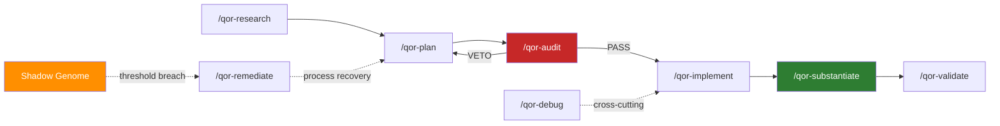

<p align="center">
  <strong>Qor-logic</strong><br>
  Standards-Aligned Governance for AI Coding Agents
</p>

<p align="center">
  <a href="https://pypi.org/project/qor-logic/"></a>
  
  
  
  
  
  
  
  
  
  
  
</p>

<p align="center">
  <a href="#latest-release">Latest Release</a> |
  <a href="#quick-start">Quick Start</a> |
  <a href="#lifecycle">Lifecycle</a> |
  <a href="#policy-engine">Policy Engine</a> |
  <a href="#skill-catalog">Skills</a> |
  <a href="#governance-model">Governance</a> |
  <a href="#key-documentation">Docs</a> |
  <a href="CONTRIBUTING.md">Contributing</a>
</p>

---

## What Qor-logic Does

Qor-logic is a governance framework that ships curated skills, doctrines, and runtime enforcement to AI coding agents. It covers the full software development lifecycle with hash-chained evidence, machine-enforceable policies, and a process-failure feedback loop.

Supported hosts: **Claude Code**, **Kilo Code**, **Codex** (provisional), **Gemini CLI**.

Built around **S.H.I.E.L.D.**, the six lifecycle phases each backed by a skill:

| | Phase | Skill | What it does |
|---|---|---|---|
| **S** | Secure Intent | `/qor-bootstrap` | Seed project DNA. Document the Why, encode the architecture, initialize the Merkle chain. |
| **H** | Hypothesize | `/qor-plan` | Create implementation blueprints with risk grades, file contracts, and Section 4 complexity limits. |
| **I** | Interrogate | `/qor-audit` | Adversarial tribunal. The Judge audits the plan for security, correctness, and drift. PASS or VETO. |
| **E** | Execute | `/qor-implement` | Build under KISS constraints after a PASS verdict. Functions under 40 lines, nesting under 3 levels. |
| **L** | Lock Proof | `/qor-substantiate` | Verify Reality matches Promise. Cryptographically seal the session with Merkle hash verification. |
| **D** | Deliver | `/qor-repo-release` | Deploy, hand off with traceability, and monitor for operational drift. |

## Latest release

See **[CHANGELOG.md](CHANGELOG.md)** for what shipped in the current release and every prior version. The CHANGELOG is the single source of truth; this section intentionally avoids version-specific content to prevent README drift.

## Quick Start

### Install from PyPI

```bash
pip install qor-logic
```

### Deploy skills to your AI coding host

By default Qor-logic installs into the **current workspace** (`./.<host>/`). Use `--scope global` for user-wide install under `~/.<host>/`.

```bash
# Initialize with host + scope (scope defaults to repo)
qor-logic init --host claude --profile sdlc                 # repo scope
qor-logic init --host gemini --profile sdlc --scope global  # global scope

# Install governance skills and agent personas
qor-logic install --host claude                # -> ./.claude/
qor-logic install --host gemini                # -> ./.gemini/commands/
qor-logic install --host codex --scope global  # -> ~/.codex/

# Verify the installation
qor-logic list --available
```

After a PyPI release, upgrade the package first, then deploy the packaged
compiled variants into each active host:

```bash
pip install --upgrade qor-logic
qor-logic install --host codex --scope global --dry-run
qor-logic install --host codex --scope global
```

Repeat the install command for `claude`, `kilo-code`, or `gemini` as needed.
See [operations.md](docs/operations.md#post-pypi-deployment-smoke) for the full
post-publish smoke checklist.

Supported host layouts:

| Host | Default folder (repo scope) | File format |
|------|-----------------------------|-------------|
| `claude` | `./.claude/skills/`, `./.claude/agents/` | Markdown |
| `kilo-code` | `./.kilo/skills/`, `./.kilo/agents/` | Markdown |
| `codex` | `./.codex/skills/`, `./.codex/agents/` | Markdown |
| `gemini` | `./.gemini/commands/` | TOML |

Set `QORLOGIC_PROJECT_DIR` to override the repo root.

### Or install to a custom target

```bash
# Non-standard host, filesystem governance, or data pipeline projects
qor-logic install --host claude --target /path/to/custom/dir/
```

### Use in your AI coding session

```
/qor-plan          # author a phased implementation plan
/qor-audit         # adversarial PASS/VETO tribunal
/qor-implement     # build under Section 4 Razor constraints
/qor-substantiate  # seal with Merkle hash evidence
```

Contributors: see [CONTRIBUTING.md](CONTRIBUTING.md) for the canonical chain and the "what not to do" list.

## Lifecycle

Qor-logic enforces a phased governance lifecycle. Each phase gates the next. Every decision is SHA256-chained in the Meta Ledger.



Each transition produces a ledger entry. VETO loops back to planning. Process failures accumulate in the Shadow Genome and auto-trigger remediation at configurable thresholds.

## Policy Engine

Qor-logic includes a Cedar-inspired policy evaluator written in pure Python. Policies are data files, not hardcoded logic.

```cedar
// qor/policies/gate_enforcement.cedar
permit (
  principal,
  action == Action::"implement",
  resource == Gate::"plan"
) when { resource.verdict == "PASS" };

forbid (
  principal,
  action == Action::"implement",
  resource == Gate::"plan"
) when { resource.verdict == "VETO" };
```

Evaluate policies from the CLI:

```bash
qor-logic policy check request.json
```

The evaluator supports `permit`/`forbid` effects, `==` and `in` constraints, `when` conditions, and default-deny semantics (forbid overrides permit). Designed for compatibility with the [Cedar](https://www.cedarpolicy.com/) language; swap in a native Cedar SDK when Python bindings ship.

## Standards Alignment

### NIST SP 800-218A (SSDF for AI)

Qor-logic maps its lifecycle to the Secure Software Development Framework practices defined in [NIST SP 800-218A](https://doi.org/10.6028/NIST.SP.800-218A):

| SSDF Practice Group | Qor-logic Implementation |
|---|---|
| **PO** Prepare the Organization | `/qor-bootstrap`, the doctrine library, `CLAUDE.md` drop-in, [CONTRIBUTING.md](CONTRIBUTING.md) |
| **PS** Protect the Software | `/qor-audit` tribunal, reliability scripts, Shadow Genome |
| **PW** Produce Well-Secured Software | `/qor-plan` > `/qor-audit` > `/qor-implement` > `/qor-substantiate` |
| **RV** Respond to Vulnerabilities | `/qor-remediate`, `/qor-debug`, threshold-triggered issue creation |

Full mapping: [`qor/references/doctrine-nist-ssdf-alignment.md`](qor/references/doctrine-nist-ssdf-alignment.md)

### OWASP Top 10

The codebase has been [audited against OWASP Top 10 (2021)](docs/security-audit-2026-04-16.md). Findings: 0 HIGH, 3 MEDIUM (integrity-hardening), 6 LOW (hygiene). No exploitable vulnerabilities. All subprocess calls use list-form argv. No shell injection surface. No unsafe deserialization.

## Skill Catalog

Skills live under `qor/skills/<category>/` (the full count is on the Skills badge above).

### SDLC (`qor/skills/sdlc/`)

| Skill | Phase | Purpose |
|---|---|---|
| `/qor-ideate` | ideate | Frame the concept and log assumptions before research |
| `/qor-research` | research | Verify external interfaces and dependencies before planning |
| `/qor-plan` | plan | Author phased plans with tests and risk grades |
| `/qor-implement` | implement | Build under KISS / Section 4 Razor constraints |
| `/qor-refactor` | implement | Section 4 Razor cleanup |
| `/qor-debug` | cross-cutting | Root-cause diagnosis with residual-sweep verification |
| `/qor-remediate` | process recovery | Process-level fix driven by the Shadow Genome |

### Governance (`qor/skills/governance/`)

| Skill | Purpose |
|---|---|
| `/qor-audit` | Adversarial PASS/VETO tribunal over the plan |
| `/qor-substantiate` | Verify Reality = Promise and seal with Merkle evidence |
| `/qor-validate` | Recalculate and verify Meta Ledger chain integrity |
| `/qor-shadow-process` | Append structured process-failure events |
| `/qor-process-review-cycle` | Periodic process-health sweep + remediation + audit |
| `/qor-governance-compliance` | Enforce physical-isolation + environment compliance constraints |

### Memory (`qor/skills/memory/`)

| Skill | Purpose |
|---|---|
| `/qor-status` | Diagnose lifecycle state and the next legal action |
| `/qor-tone` | Set session communication tier (technical / standard / plain) |
| `/qor-document` | Author and maintain governance documentation |
| `/qor-docs-technical-writing` | Narrative technical writing for product-facing docs |
| `/qor-organize` | Project-level structure reorganization |

### Meta (`qor/skills/meta/`)

| Skill | Purpose |
|---|---|
| `/qor-bootstrap` | Seed a new workspace with governance DNA |
| `/qor-help` | Conversational command catalog and SDLC navigator |
| `/qor-onboard-codebase` | Absorb an external codebase into governed scope |
| `/qor-repo-audit` | Repository-level governance audit |
| `/qor-repo-release` | Delivery-gate / release-ceremony orchestration |
| `/qor-repo-scaffold` | New-repo governance-scaffold generation |
| `/qor-meta-log-decision` | Record a major engineering decision into the Meta Ledger |
| `/qor-meta-track-shadow` | Capture a failed approach into the Shadow Genome |
| `/qor-ab-run` | A/B measurement harness for skill-variant detection |

### Workflow bundles

| Bundle | Phases | Use when |
|---|---|---|
| `/qor-deep-audit` | recon (3) + remediate (3) | Pre-release readiness, tech-debt sweep |
| `/qor-deep-audit-recon` | research + synthesize + verify | Investigation only; ends at a research brief |
| `/qor-deep-audit-remediate` | plan + implement + validate | Action half; consumes the research brief |

## Governance Model

1. **Every decision is logged.** Plans, audits, and substantiations land in `docs/META_LEDGER.md` as SHA256-chained entries. Verify the full chain: `qor-logic verify-ledger`.

2. **Gates are advisory with teeth.** Skills check for prior-phase artifacts. Override is permitted but logged as a severity-1 `gate_override` event in the Shadow Genome.

3. **Process failures are append-only.** `docs/PROCESS_SHADOW_GENOME.md` stores JSONL events that flow through stale-expiry rules and aged-high-severity self-escalation. Threshold breach (severity sum >= 10) triggers `/qor-remediate`.

4. **Policies are data.** Cedar-syntax `.cedar` files under `qor/policies/` define permit/forbid rules evaluated at gate check points. The policy engine logs every decision for audit.

5. **Skills delegate explicitly.** When `/qor-audit` finds a Razor violation, it names `/qor-refactor`. No skill reinvents another skill's process. ([delegation-table](qor/gates/delegation-table.md))

6. **Bundles checkpoint and budget.** Multi-phase workflows declare budgets and surface progress between phases. Context windows stay manageable. ([workflow-bundles](qor/gates/workflow-bundles.md))

## Architecture

```
qor-logic/
  qor/
    skills/           Governance skills + multi-phase bundles (governance, sdlc, memory, meta)
    agents/           13 agent personas
    policy/           Cedar-inspired permit/forbid evaluator (pure Python)
    policies/         .cedar policy files (gate enforcement, skill admission, OWASP)
    scripts/          Runtime: ledger, gates, shadow, platform, compiler, remediate, doc-integrity (core + strict), drift-report, pr-citation-lint, changelog-stamp
    reliability/      Intent Lock, Skill Admission, Gate-to-Skill Matrix, Seal Entry Check
    references/       Doctrines + patterns + ql-templates + glossary + skill-recovery-pattern
    gates/            Phase chain, delegation table, workflow bundles, 9 JSON schemas
    resources.py      importlib.resources wrapper for packaged assets
    workdir.py        $QOR_ROOT / CWD anchor for consumer-state paths
    hosts.py          Host-to-install-path resolver (claude, kilo, codex, gemini)
    cli.py            qor-logic CLI entry point
    dist/variants/    Pre-compiled per-host outputs (claude, kilo-code, codex, gemini)
  docs/
    architecture.md   System-tier doc: layer stack + responsibilities
    lifecycle.md      System-tier doc: phase sequence + substantiate steps
    operations.md     System-tier doc: operator runbook + CLI + runbook
    policies.md       System-tier doc: policy files + standards alignment
    META_LEDGER.md    SHA256-chained decision log
    SHADOW_GENOME.md  Narrative failure-pattern catalog
    SYSTEM_STATE.md   Current repo state snapshot
    BACKLOG.md        Work queue
  tests/              Unit, integration, e2e, doctrine, bundle-contract, install-sync, and workflow-budget tests
  .github/workflows/  ci.yml + release.yml + pr-lint.yml (PR citation) + pr-dependency-review.yml
```

## CLI Reference

```
# Install + workspace
qor-logic install --host <claude|kilo-code|codex|gemini> [--scope <repo|global>] [--target <path>] [--dry-run]
qor-logic uninstall --host <host> [--scope <repo|global>]
qor-logic init --host <host> [--scope <repo|global>] --profile <sdlc|filesystem|data|research>
qor-logic list [--available] [--installed] [--host <host>] [--scope <repo|global>]
qor-logic info <skill-name>
qor-logic compile [--dry-run]
qor-logic seed

# Governance + integrity
qor-logic verify-ledger [--ledger <path>] [--post-anchor]
qor-logic governance-health [--profile skill-entry]
qor-logic governance-index [--advance-last-reviewed <date>] [--enforce]
qor-logic capabilities <inventory|context|route-risk|verification-request> [...]
qor-logic policy check <request.json>

# Compliance + downstream enforcement SDK
qor-logic compliance <report|ai-provenance|sprint-progress> [...]
qor-logic compliance enforce --engagement <pre-commit|pre-push|pre-tool-write|ci|seal> [--repo-root <path>]
# enforce reports an explicit verdict (enforced/failed/no_op) + per-control status
# (pass/fail/skip/disclosed); ci/seal run real controls, never a vacuous pass. Runner
# semantics + disclosed-skip: see qor/references/downstream-enforcement-sdk.md

# Release + reconciliation + module dispatch
qor-logic release [...]
qor-logic reconcile [...]
qor-logic scripts <module> [args]        # run a qor.scripts.<module> via the CLI interpreter
qor-logic reliability <module> [args]    # run a qor.reliability.<module>
qor-logic --version
```

## Development

```bash
pip install -e ".[dev]"
python -m pytest tests/                                    # full test suite
python -m pytest tests/ -m integration                     # install-smoke tests
qor-logic verify-ledger                                     # Merkle chain integrity
BUILD_REGEN=1 python qor/scripts/dist_compile.py           # regenerate variants
python qor/scripts/check_variant_drift.py                  # SSoT vs dist consistency
```

## Key Documentation

### System-tier docs (the four pillars)

| Document | Purpose |
|---|---|
| [`docs/architecture.md`](docs/architecture.md) | Layer stack: entry points -> references -> gates -> skills -> scripts -> policies -> artifacts |
| [`docs/lifecycle.md`](docs/lifecycle.md) | Phase sequence + per-phase contracts + substantiate step expansion (Steps 0-Z) + session/branch/version models |
| [`docs/operations.md`](docs/operations.md) | Operator runbook: CLI, seal ceremony, push/merge, failure recovery, CI, dist variants, troubleshooting |
| [`docs/policies.md`](docs/policies.md) | Policy files, OWASP/NIST alignment, change_class contract, shadow-genome rubric, escape paths |

### Entry points + governance

| Document | Purpose |
|---|---|
| [`CLAUDE.md`](CLAUDE.md) | Drop-in token-efficiency + test-discipline + governance-flow defaults |
| [`CONTRIBUTING.md`](CONTRIBUTING.md) | Reading order + quickstart + what-not-to-do for contributors |
| [`CHANGELOG.md`](CHANGELOG.md) | User-facing release narrative (Keep-a-Changelog 1.1.0) |
| [`docs/META_LEDGER.md`](docs/META_LEDGER.md) | SHA256-chained governance log |
| [`docs/SHADOW_GENOME.md`](docs/SHADOW_GENOME.md) | Narrative failure-pattern catalog |
| [`docs/SYSTEM_STATE.md`](docs/SYSTEM_STATE.md) | Current repo state snapshot (updated per seal) |
| [`docs/FEATURE_INDEX.md`](docs/FEATURE_INDEX.md) | Verified feature inventory: every user-touchable CLI command mapped to a source-of-truth `file:line`, a doc citation, and a passing test |
| [`docs/phase31-drift-triage-report.md`](docs/phase31-drift-triage-report.md) | Live drift triage artifact (Check Surface D/E) |

### Gates + routing

| Document | Purpose |
|---|---|
| [`qor/gates/chain.md`](qor/gates/chain.md) | Canonical phase sequence (research -> plan -> audit -> implement -> substantiate -> validate -> remediate) |
| [`qor/gates/delegation-table.md`](qor/gates/delegation-table.md) | Skill-to-skill handoff matrix |
| [`qor/gates/workflow-bundles.md`](qor/gates/workflow-bundles.md) | Bundle checkpoint and budget protocol |

### Audits + standards

| Document | Purpose |
|---|---|
| [`docs/RESEARCH_BRIEF.md`](docs/RESEARCH_BRIEF.md) | Phase 28 recon: documentation-integrity gap audit (18 gaps identified, all closed by Phase 31) |
| [`docs/security-audit-2026-04-16.md`](docs/security-audit-2026-04-16.md) | OWASP Top 10 + stability audit |
| [`qor/references/doctrine-nist-ssdf-alignment.md`](qor/references/doctrine-nist-ssdf-alignment.md) | NIST SP 800-218A lifecycle mapping |
| [`qor/references/doctrine-shadow-genome-countermeasures.md`](qor/references/doctrine-shadow-genome-countermeasures.md) | Codified failure-pattern countermeasures |

### Doctrines (complete inventory)

Each doctrine under `qor/references/` carries a single rule or convention cited by one or more skills.

| Doctrine | Purpose |
|---|---|
| [ai-rmf](qor/references/doctrine-ai-rmf.md) | NIST AI RMF 1.0 Govern / Map / Measure / Manage mapping |
| [attribution](qor/references/doctrine-attribution.md) | Canonical commit-trailer / PR-footer / CHANGELOG attribution for Qor-logic-SDLC-authored work; helper at `qor/scripts/attribution.py` |
| [audit-report-language](qor/references/doctrine-audit-report-language.md) | VETO ground-class to skill directive mapping |
| [changelog](qor/references/doctrine-changelog.md) | Keep-a-Changelog discipline + seal-time stamp |
| [ci-budget](qor/references/doctrine-ci-budget.md) | CI compute and latency budget |
| [code-quality](qor/references/doctrine-code-quality.md) | Section 4 Simplicity Razor + anti-slop rules |
| [communication-tiers](qor/references/doctrine-communication-tiers.md) | Technical / standard / plain output tiers |
| [compliance-conveyance](qor/references/doctrine-compliance-conveyance.md) | Compliance control matrix + conveyance conformance + ratchet + downstream enforcement SDK |
| [context-discipline](qor/references/doctrine-context-discipline.md) | Persona scaffolding + measurable-effect contract for SDLC personas |
| [definition-of-done](qor/references/doctrine-definition-of-done.md) | Per-deliverable D1-D4 acceptance criteria |
| [dependency-admission](qor/references/doctrine-dependency-admission.md) | Dependency admission + cooling-period supply-chain control |
| [documentation-integrity](qor/references/doctrine-documentation-integrity.md) | Tiered doc topology + glossary + check surface + documentation currency |
| [eu-ai-act](qor/references/doctrine-eu-ai-act.md) | EU AI Act Art. 9 / 13 / 14 / 50 risk-management + transparency mapping |
| [feature-inventory](qor/references/doctrine-feature-inventory.md) | FEATURE_INDEX artifact format + seal-time verification |
| [feature-tdd](qor/references/doctrine-feature-tdd.md) | Per-feature TDD-Light contract (plan / audit / implement) |
| [governance-enforcement](qor/references/doctrine-governance-enforcement.md) | Branch / version / tag / push / session-rotation / PR-citation protocol |
| [governance-index](qor/references/doctrine-governance-index.md) | Hierarchical governance index + self-policing enforcement |
| [hook-contract](qor/references/doctrine-hook-contract.md) | Non-authoritative `gate_written` observer-hook contract |
| [host-repo-posture](qor/references/doctrine-host-repo-posture.md) | Host-repo posture + capability checks for non-Python archetypes |
| [ideation-readiness](qor/references/doctrine-ideation-readiness.md) | Governed ideation-readiness contract for `/qor-ideate` |
| [ledger-concurrency](qor/references/doctrine-ledger-concurrency.md) | Linearize the ledger hash-chain at the trunk (GH #231): WARN-first base-currency gate + re-anchor helper |
| [nist-ssdf-alignment](qor/references/doctrine-nist-ssdf-alignment.md) | NIST SP 800-218A practice-tag mapping |
| [owasp-governance](qor/references/doctrine-owasp-governance.md) | OWASP Top 10 governance integration |
| [procedural-fidelity](qor/references/doctrine-procedural-fidelity.md) | Doc-surface coverage for skill / script / doctrine / schema changes |
| [prompt-compilation](qor/references/doctrine-prompt-compilation.md) | Prompt-compilation + per-host variant-output rules |
| [prompt-injection](qor/references/doctrine-prompt-injection.md) | Prompt-injection canary scanning at audit |
| [prompt-resilience](qor/references/doctrine-prompt-resilience.md) | Autonomy classification + pause-smell detection |
| [provenance-binding](qor/references/doctrine-provenance-binding.md) | Gate-artifact provenance binding (GAP-GOV-05): per-session HMAC sidecars (Layer A) + CI attestation (Layer B); honest threat-model ceiling |
| [publication-boundary](qor/references/doctrine-publication-boundary.md) | No tracked file may identify a repository outside Qor-logic; structural lint + operator-local terms overlay |
| [runtime-principal-fidelity](qor/references/doctrine-runtime-principal-fidelity.md) | Data-API access-control + runtime-principal verification |
| [shadow-attribution](qor/references/doctrine-shadow-attribution.md) | Shadow skill attribution rules |
| [shadow-genome-countermeasures](qor/references/doctrine-shadow-genome-countermeasures.md) | Codified recurring failure-pattern countermeasures |
| [shadow-genome-graph](qor/references/doctrine-shadow-genome-graph.md) | Shadow Genome event-graph model |
| [test-discipline](qor/references/doctrine-test-discipline.md) | TDD, definition of done, reliability rules |
| [test-functionality](qor/references/doctrine-test-functionality.md) | Tests must invoke the unit and assert on output, not just verify artifact presence |
| [token-efficiency](qor/references/doctrine-token-efficiency.md) | Terse-by-default output + read/write discipline |
| [verification-closure-integrity](qor/references/doctrine-verification-closure-integrity.md) | Prose-behavior test lint + verification-closure rules |

Patterns and templates (non-binding references):

- [patterns-agent-design](qor/references/patterns-agent-design.md), [patterns-architecture](qor/references/patterns-architecture.md), [patterns-devops](qor/references/patterns-devops.md), [patterns-project-planning](qor/references/patterns-project-planning.md), [patterns-skill-lifecycle](qor/references/patterns-skill-lifecycle.md), [patterns-ui-diagnosis](qor/references/patterns-ui-diagnosis.md), [patterns-voice-integration](qor/references/patterns-voice-integration.md)
- [ql-audit-templates](qor/references/ql-audit-templates.md), [ql-bootstrap-templates](qor/references/ql-bootstrap-templates.md), [ql-implement-patterns](qor/references/ql-implement-patterns.md), [ql-organize-templates](qor/references/ql-organize-templates.md), [ql-refactor-examples](qor/references/ql-refactor-examples.md), [ql-substantiate-templates](qor/references/ql-substantiate-templates.md), [ql-validate-reports](qor/references/ql-validate-reports.md)
- [skill-recovery-pattern](qor/references/skill-recovery-pattern.md)
- [glossary](qor/references/glossary.md) -- canonical term registry introduced in Phase 28

## Shadow Genome

The Shadow Genome is Qor-logic's institutional memory for failure patterns. Every governance failure (plan VETOes, import breakage, arithmetic drift, silent data loss) is recorded, classified, and codified as a countermeasure.

Representative codified patterns (full set in the doctrine):

| ID | Pattern | Countermeasure |
|---|---|---|
| SG-016 | Generic-convention paths without grounding | Grep/read before citing any path |
| SG-021 | Multi-layer edit compression | Enumerate every file that receives the edit |
| SG-032 | Batch-split-write coverage gap | Classify records at creation, not post-hoc |
| SG-033 | Positional-to-keyword signature breakage | Grep all callers before adding `*` |
| SG-036 | Doctrine adoption grace period | No grace period; inline grounding immediately |
| SG-038 | Prose-code mismatch in plans | Grep plan for every enumeration; update in lockstep |

Full inventory: [`qor/references/doctrine-shadow-genome-countermeasures.md`](qor/references/doctrine-shadow-genome-countermeasures.md)

## License

Business Source License 1.1 (BSL-1.1). Free for non-production use. Production deployment requires a commercial license from [MythologIQ Labs, LLC](https://github.com/MythologIQ-Labs-LLC). See [LICENSE](LICENSE) for details.

## Contributing

Skills live under `qor/skills/<category>/<skill-name>/SKILL.md` (the single source of truth). The `qor/dist/variants/` outputs are generated. Never edit them directly.

To author a new skill:

1. Pick a category: `governance`, `sdlc`, `memory`, or `meta`.
2. Create `qor/skills/<category>/<name>/SKILL.md` with required frontmatter (`name`, `description`, `phase`, `gate_reads`, `gate_writes`).
3. Add a row to [`qor/gates/delegation-table.md`](qor/gates/delegation-table.md).
4. Register in [`/qor-help`](qor/skills/meta/qor-help/SKILL.md).
5. Regenerate: `BUILD_REGEN=1 python qor/scripts/dist_compile.py`
6. Test: `python -m pytest tests/`

For workflow bundles, follow the metadata schema in [`qor/gates/workflow-bundles.md`](qor/gates/workflow-bundles.md). Bundle contract tests in `tests/test_bundles.py` cover new bundles automatically.
