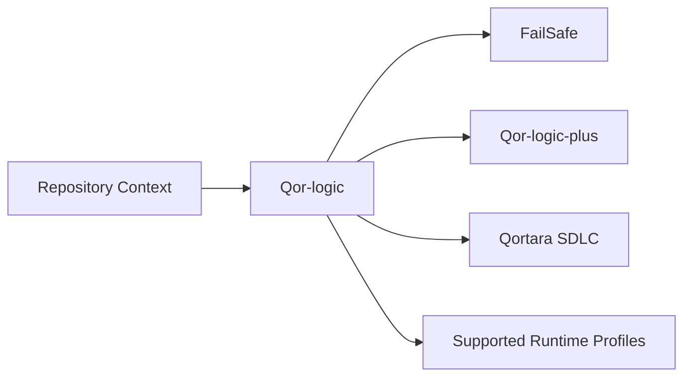

# Qor-logic Ecosystem Position

## Role

Qor-logic is the public, portable semantic authority for repository-local governance and the governed software-development lifecycle.

It defines lifecycle doctrine and evidence meaning. It does not own a complete customer application, hosted tenant state, organization-wide authority, compliance conclusions, or operator presentation.

## Position

The arrows represent consumption of versioned lifecycle, gate, policy, skill, and evidence contracts. They do not transfer semantic authority away from Qor-logic.

## Owns

- SHIELD lifecycle semantics;
- repository-local planning and audit contracts;
- skills and host-distribution behavior;
- lifecycle gates and policy meaning;
- evidence semantics;
- Meta Ledger behavior;
- Shadow Genome behavior;
- portable repository governance doctrine;
- conformance fixtures for these contracts.

## Consumes

- repository and workspace context;
- supported host capabilities;
- source-control state;
- validator and evidence-provider outputs through declared interfaces.

## Produces

- lifecycle state and transition contracts;
- plan and audit artifacts;
- gate verdicts;
- evidence requirements and references;
- portable skills and policies;
- ledger and Shadow Genome records;
- compatibility metadata for consumers.

## Does not own

- organization actors, delegated authority, work claims, conflicts, admission, resources, or release sequencing owned by Qor-logic-plus;
- a complete editor, web, desktop, or hosted product;
- tenant identity, billing, subscriptions, or fleet operations;
- operator read models owned by Qor Oversight;
- compliance packages or control conclusions owned by Qor Compliance;
- runtime action-governance functionality already supplied by external foundations unless explicitly adopted into a Qor-logic contract.

## Consumer rule

Consumers may implement Qor-logic contracts, but they must not silently redefine lifecycle phases, verdict meaning, evidence sufficiency, or completion semantics.

A compatibility adapter must declare:

- Qor-logic version range;
- consumed contracts;
- unsupported behavior;
- evidence translations;
- failure behavior;
- migration and rollback behavior.

## Immediate path forward

1. Stabilize the public lifecycle, gate, evidence, ledger, and Shadow Genome schemas.
2. Publish conformance fixtures for each supported host and consumer.
3. Define compatibility floors and explicit deprecation policy.
4. Separate portable semantics from host-specific presentation and orchestration.
5. Complete the contracts required by the first Qortara SDLC vertical slice.
6. Add documentation checks that prevent consumers from claiming Qor authority they do not own.

## Public disclosure boundary

This document describes current public contracts and product relationships. It does not announce private product-transition, branding, or launch plans.